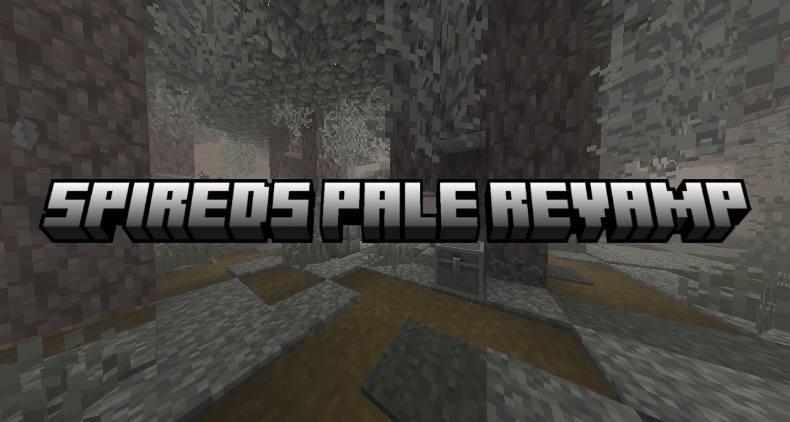
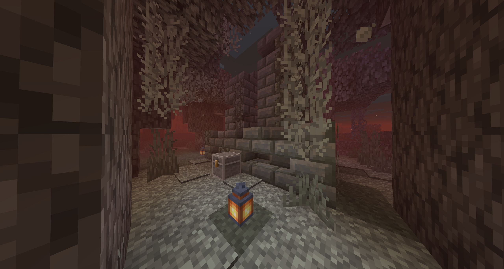
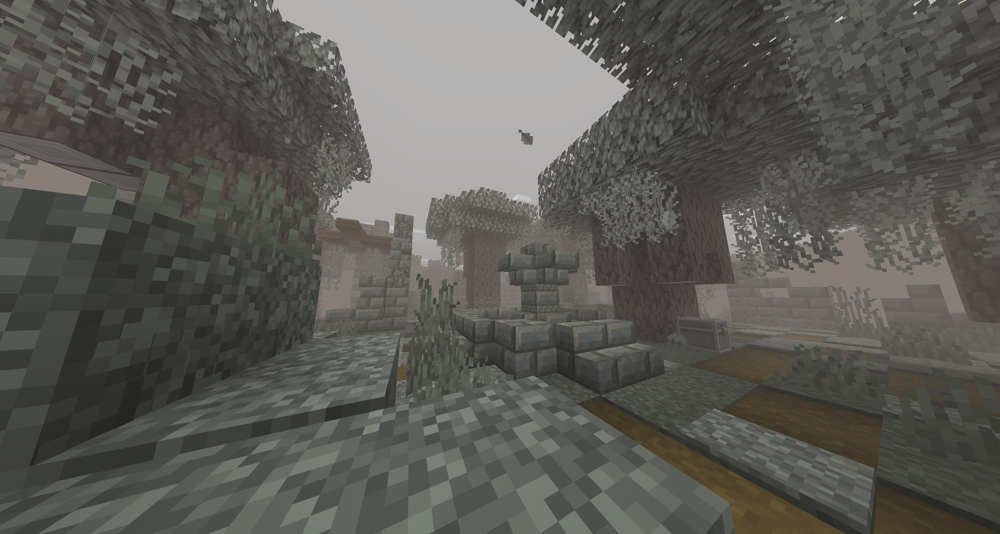
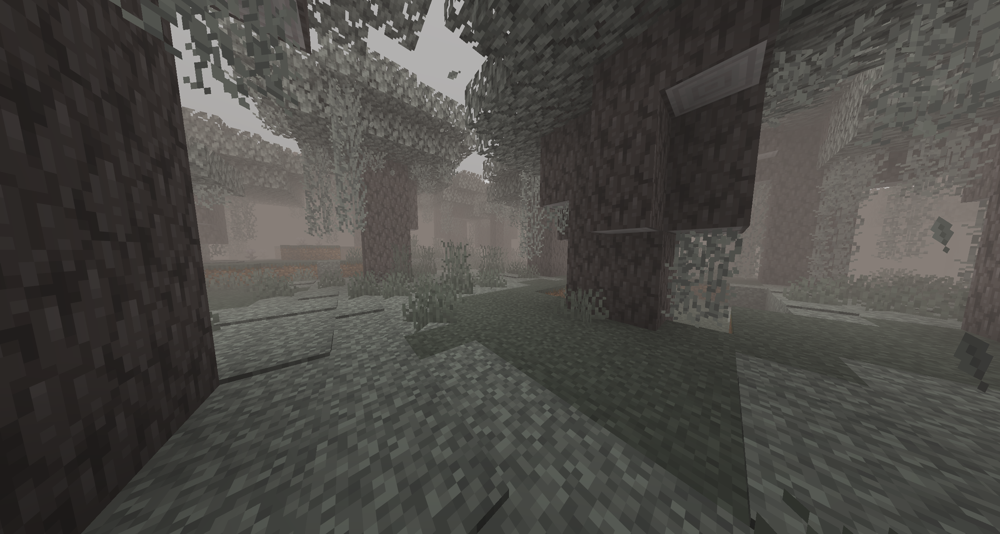
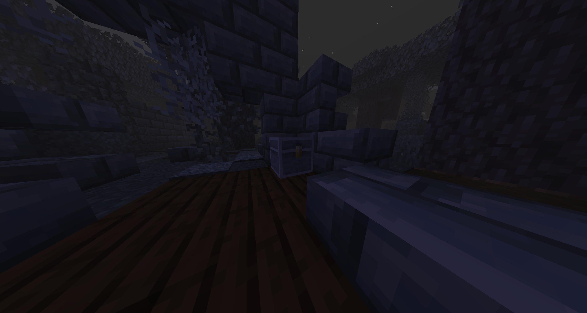

Spired's Pale Revamp is a mod that redesigns the pale garden biome to act more like the deep dark
by making it a more dangerous place during night but also very rewarding.

### Features and Changes

4 New structures

Pale Garden fog (can be turned off in the config menu)

New chest called the Pale Chest a chest which's contents cannot be accessed during the day

New explorer map trade from the Cartographer Villagers for a pale explorer map which locates Pale Ruins

The Creaking is a lot more dangerous and deals significantly more damage 

Mobs no longer spawn in the pale garden biome

### Planed Features

- More Structures
- Unique items that can be found from loot or crafted
- Larger Pale Garden generation (currently looking into this)
- Punish the Player for destroying creaking hearts during the day

### Further Notes

This is my first mod ever so sorry if it is a bit rough around the edges, any feedback about the mod is always welcome.
I enjoyed making it a lot and will continue to develop it by adding more features and porting it to other versions.